# Local Convertor

A local, menu-driven media inspector and converter built with Python and
FFmpeg. The application opens a native file picker, inspects the selected
media, and lets you extract streams, transcode, remux, display a report, or
save a JSON report when exiting.

## Screenshots

### Application startup and media selection

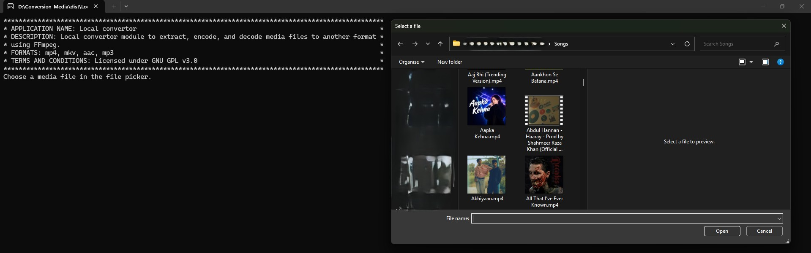

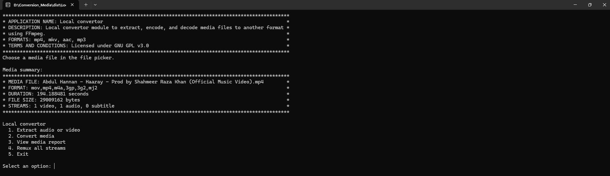

### Extracting a stream

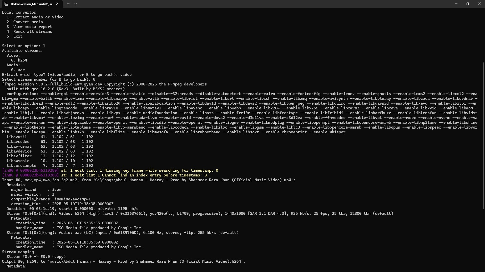

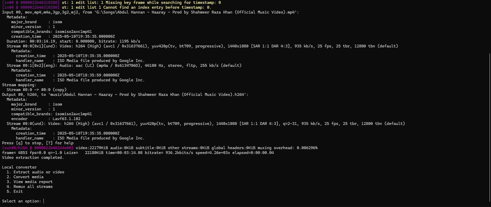

### Converting media

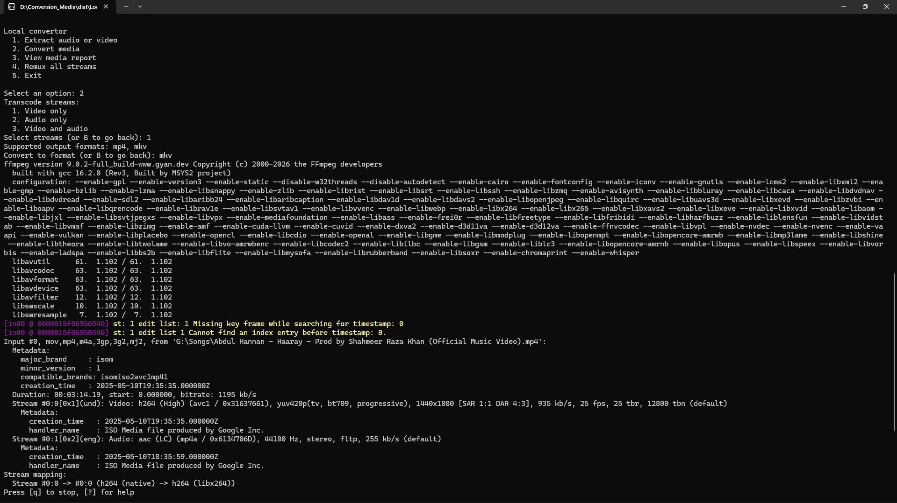

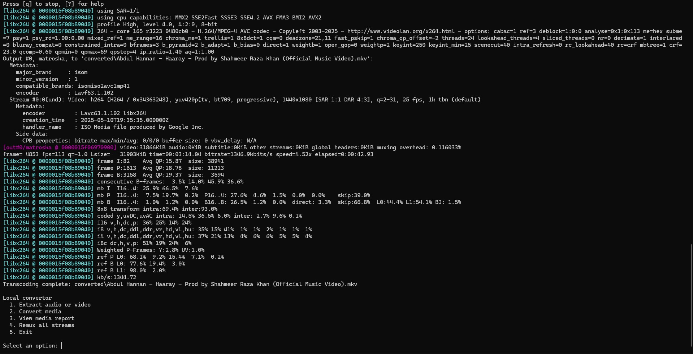

### Viewing a media report

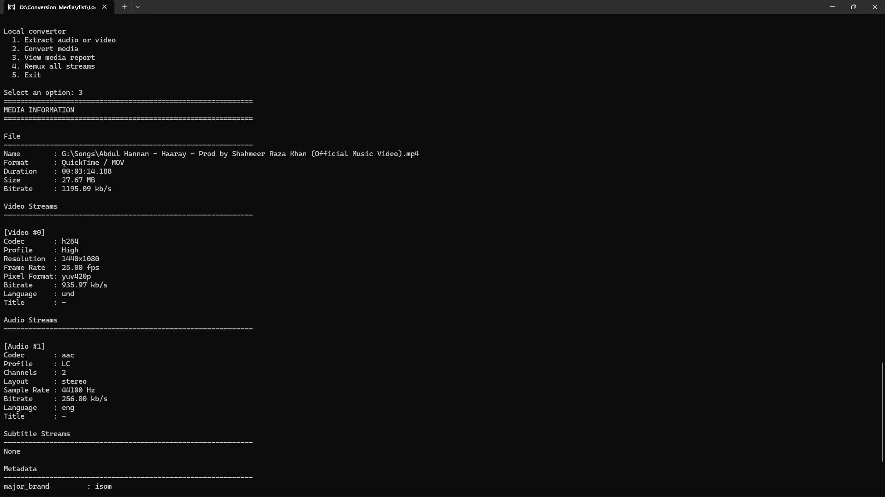

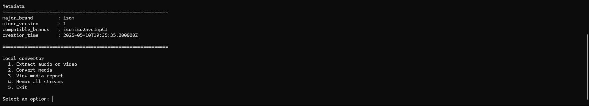

### Remuxing

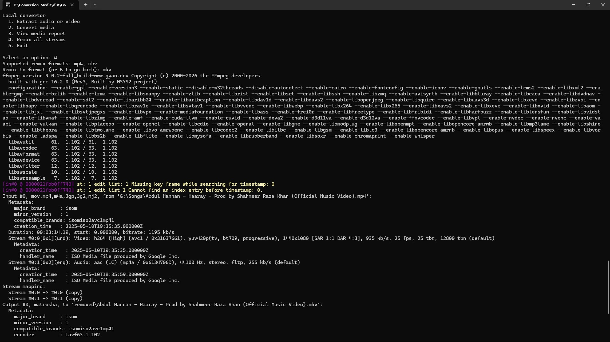

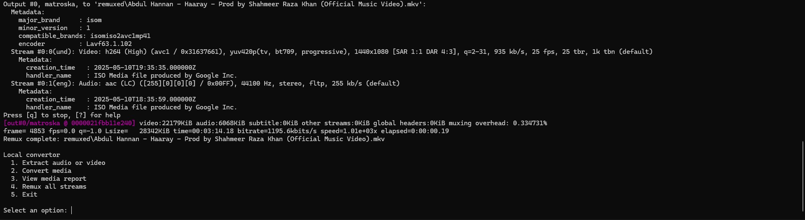

### Exiting the application

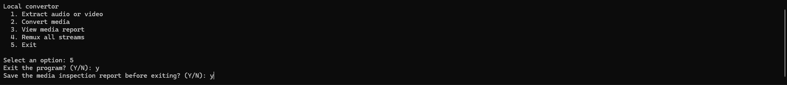

### Output folders

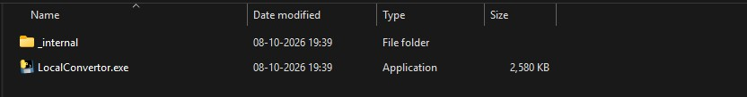

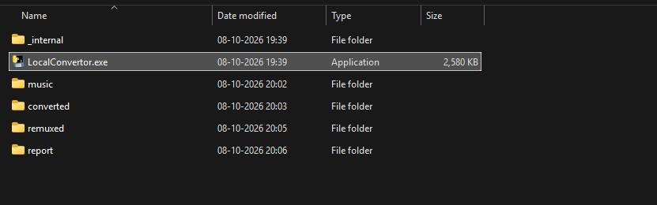

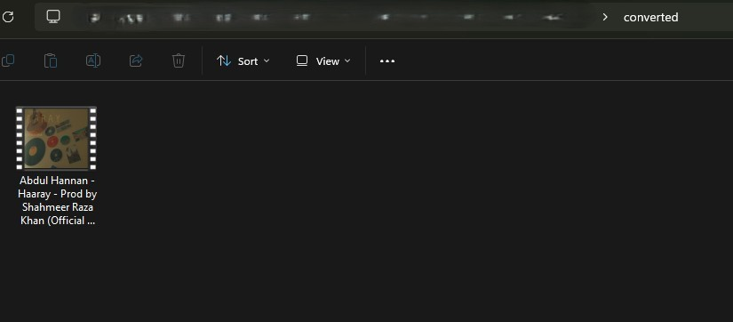

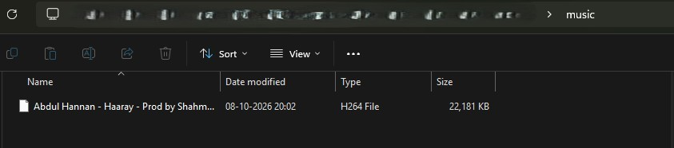

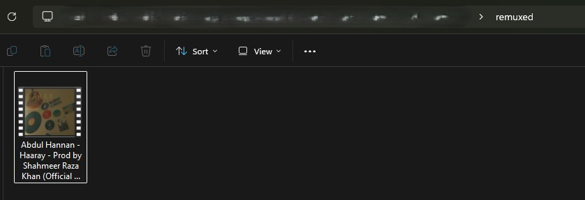

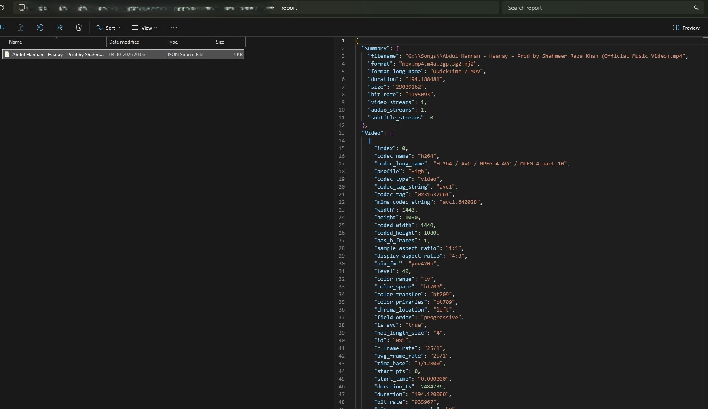

## Project Objective

Provide a straightforward desktop-console workflow for inspecting and
converting local video and audio files without uploading them to an online
service. FFmpeg performs the media operations; FFprobe supplies media
metadata.

## Project Functioning

1. Start the app. It opens the platform's file picker:
   - Windows: the native PowerShell file picker.
   - Linux: Zenity or KDialog, with a Tkinter fallback.
   - macOS: the native AppleScript file picker.
   - WSL: the Windows picker, with the selected path converted to a WSL path.
2. The app probes the selected file and displays a summary.
3. Choose an operation from the console menu:
   - **Extract audio or video:** choose one available audio or video stream.
     The stream is copied without re-encoding.
   - **Convert media:** choose video-only, audio-only, or both, then choose a
     supported output format. Selected streams are transcoded.
   - **View media report:** display a readable report in the console.
   - **Remux all streams:** copy media into another container without
     re-encoding. The app explicitly selects every input stream; remuxing can
     fail if the destination container cannot store one of those streams.
   - **Exit:** optionally save a JSON inspection report before quitting.

Output folders are created when their corresponding operation runs; they are
not all created at startup:

| Operation | Default output folder |
| --- | --- |
| Transcoding | `converted/` |
| Stream extraction | `music/` |
| Remuxing | `remuxed/` |
| Saved JSON reports | `report/` |

## Installation and Running

### Requirements

- Python 3.10 or newer.
- FFmpeg and FFprobe installed and available on `PATH`.
- Python dependencies from `requirements.txt`.
- A desktop session and an available file picker for the current operating
  system. On Linux, install Zenity or KDialog, or use the Tkinter fallback.

Install the Python dependencies:

```bash
python -m pip install -r requirements.txt
```

Run the application from the project directory:

```bash
python app_main.py
```

Run the tests:

```bash
bash tests/run_tests.sh
```

The test runner writes timestamped JUnit XML results under `test-results/`.
The integration tests generate a short sample clip in a temporary directory
and run real FFmpeg/FFprobe operations; they require both tools on `PATH`.
Run only these tests with:

```bash
python -m pytest -q tests/test_media_integration.py
```

## Documentation site

The project documentation is maintained in `docs/` and published with
MkDocs Material and GitHub Pages. To preview it locally:

```bash
python -m pip install -r requirements-docs.txt
mkdocs serve
```

Open <http://127.0.0.1:8000>. To validate the site build:

```bash
mkdocs build --strict
```

The GitHub Actions workflow validates documentation on pull requests to
`master` and deploys it to GitHub Pages after pushes to `master`. In the
repository's GitHub settings, configure **Pages → Build and deployment →
Source** as **GitHub Actions**.

## Project Structure

```text
.
├── app_main.py                 # Application launcher
├── file_main.py                # Interactive console menu and user workflow
├── deocder_main.py             # Audio/video transcoding
├── demuxer_main.py             # Stream extraction and container remuxing
├── path_helper.py              # Windows/WSL path conversion
├── fixed_values/
│   └── constants.py            # App labels and supported format lists
├── media/
│   ├── media_inspector.py      # FFprobe inspection and report data
│   ├── print_media_report.py   # JSON and readable report output
│   └── utility_functions.py    # Report formatting helpers
├── utilities/
│   ├── file_ops.py             # Platform-specific file picker
│   ├── ffmpeg_utils.py         # FFmpeg error formatting
│   └── platform_name.py        # Operating-system identification
├── docs/                       # MkDocs documentation pages
├── mkdocs.yml                  # Documentation site configuration
├── tests/                      # Automated tests
├── requirements.txt            # Python dependencies
└── test-results/               # Generated test reports
```

The `converted/`, `music/`, `remuxed/`, and `report/` folders contain
operation results and are created as needed.

## Project API and Options

The interactive menu is the primary interface. The following classes can
also be used directly from Python.

### `MediaInspector`

Defined in `media.media_inspector`.

- `MediaInspector(file_path)` validates and prepares an existing media file.
- `get_media_details()` probes and caches the FFprobe result.
- `get_summary()`, `get_format()`, `get_metadata()`, and `get_chapters()`
  return media information.
- `extract_video_streams()`, `extract_audio_streams()`,
  `extract_subtitle_streams()`, `extract_data_streams()`, and
  `extract_attachment_streams()` return stream details by type.
- `print_text_report()` prints the readable report.
- `print_report()` prints the structured report as JSON text.
- `save_report(output_dir="report")` saves a uniquely named JSON report and
  returns its report data.

### `Transcoder`

Defined in `deocder_main`.

```python
Transcoder(file_path).transcode(
    output_format,
    output_dir="converted",
    stream_mode="both",
    video_codec="libx264",
    audio_codec=None,
    overwrite=False,
)
```

- `stream_mode` accepts `"video"`, `"audio"`, or `"both"`.
- Video-only and combined audio/video outputs support `mp4` and `mkv`.
- Audio-only outputs support `aac` and `mp3`.
- If `audio_codec` is omitted, AAC is used except for MP3 output, which uses
  `libmp3lame`.
- An existing output is not overwritten unless `overwrite=True`.
- The output path is returned.

### `Muxer`

Defined in `demuxer_main`.

- `muxing(stream_type, codec_name, output_filename, output_dir="music",
  stream_index=0, overwrite=False)` copies one audio or video stream without
  re-encoding. It returns the output path. In the console workflow, the file
  extension is the stream's codec name.
- `remuxing(output_filename=None, output_format="mkv",
  output_dir="remuxed", overwrite=False)` copies streams into an MP4 or MKV
  container without re-encoding. Codec/container compatibility can affect
  whether the operation succeeds.

## Suggestions and Issues

Suggestions, bug reports, and questions are welcome. Contact the owner by
email at [sanketsonowal@gmail.com](mailto:sanketsonowal@gmail.com). When
reporting a problem, include:

- Operating system and Python version.
- The menu option and format/mode selected.
- The complete error message and steps to reproduce it.
- Whether FFmpeg and FFprobe are installed and available on `PATH`.

Do not attach private media or other sensitive files; a short description of
the media's container and stream types is usually sufficient.

Possible improvements include validating the output codec/container
combination before starting FFmpeg, supporting configurable output paths, and
expanding automated tests to cover additional codecs and containers.

## Owner

- **Display name:** KomeOn
- **Email:** [komeongithub@duck.com](mailto:komeongithub@duck.com)

## License

This project is licensed under the **GNU General Public License v3.0**
(GPL-3.0). See [`LICENSE`](./LICENSE) for the complete license text.

Copyright (C) 2026 KomeOn.
